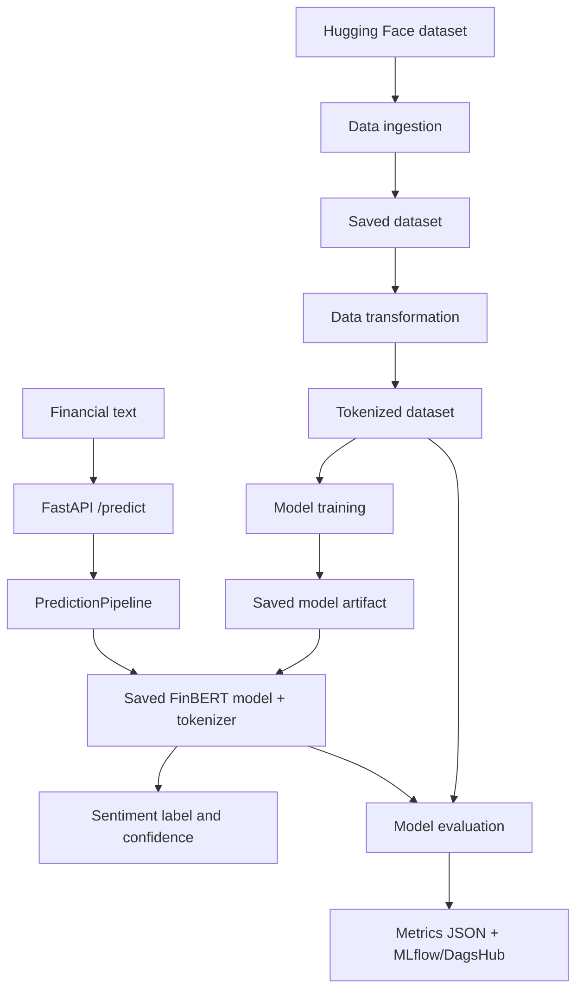
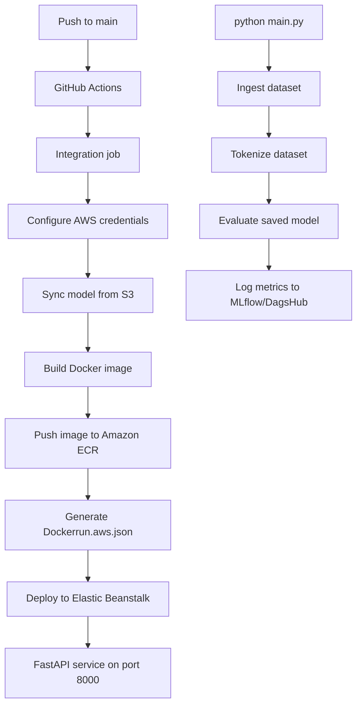

# Financial Phrase Classifier

Production-oriented financial sentiment classification using
[ProsusAI/FinBERT](https://huggingface.co/ProsusAI/finbert), Hugging Face
Datasets, and a FastAPI inference service.

The project classifies financial text as **bearish**, **bullish**, or
**neutral**. It includes a reproducible data pipeline, a Colab research
notebook, MLflow/DagsHub evaluation logging, Docker packaging, and an
AWS-based CI/CD workflow.

## Highlights

- Downloads `zeroshot/twitter-financial-news-sentiment` from the Hugging Face
  Hub and stores it as a local DatasetDict.
- Tokenizes the dataset with the FinBERT tokenizer.
- Fine-tunes a three-class `AutoModelForSequenceClassification`.
- Evaluates with accuracy and macro F1, saving metrics to
  `artifacts/model_evaluation/metrics.json`.
- Serves predictions through FastAPI and automatically exposes Swagger UI.
- Builds a CPU-oriented Docker image and deploys it to AWS Elastic Beanstalk
  through Amazon ECR.

## Architecture



## Training and deployment workflow



> **Current runtime behavior:** `main.py` executes data ingestion, validation, and
> transformation, but the model training stage (implemented in
> `src/components/model_trainer.py`) is intentionally bypassed. Instead of relying
> on local training—which was constrained to 1 epoch under limited compute
> settings—the pipeline utilizes high-performance weights trained across 3 epochs
> in Google Colab. Runtime inference therefore expects the pre-trained model
> artifact at `artifacts/model_trainer/finbert-model`, which the deployment workflow
> automatically pulls from S3 prior to building the Docker image.

## Quick start

### 1. Install

Python 3.12 is used by the Docker image.

```bash
git clone https://github.com/AdityaRanganekar/FinancialPhraseClassifier.git
cd FinancialPhraseClassifier
python -m venv venv
source venv/bin/activate
pip install -r requirements.txt
pip install -e .
```

### 2. Prepare artifacts

Run the pipeline from the repository root:

```bash
python main.py
```

This downloads and tokenizes the dataset, then evaluates the model configured
at `artifacts/model_trainer/finbert-model`. To create or refresh that model,
use the Colab experiment in
[`research/financialphraser.ipynb`](research/financialphraser.ipynb), or
enable and run the training stage in `main.py` after reviewing its
resource settings.

### 3. Start the API

```bash
python app.py
```

The service listens on `http://localhost:8000`. Open
[`http://localhost:8000/docs`](http://localhost:8000/docs) for interactive
Swagger documentation.

### Docker

```bash
docker build -t financial-phrase-classifier .
docker run --rm -p 8000:8000 financial-phrase-classifier
```

The container installs CPU-only PyTorch and serves the API on port `8000`.

## API reference

### `GET /`

Redirects to the interactive API documentation at `/docs`.

### `POST /predict`

Request:

```bash
curl -X POST "http://localhost:8000/predict" \
  -H "Content-Type: application/json" \
  -d '{"text":"Operating margins expanded by 120 bps due to aggressive supply chain restructuring."}'
```

Response:

```json
{
  "text": "Operating margins expanded by 120 bps due to aggressive supply chain restructuring.",
  "sentiment": "bearish",
  "confidence": 0.9221
}
```

The example prediction is taken from the Colab experiment; confidence is
rounded to four decimal places by the API.

### `GET /train`

Runs `main.py` in the application process and returns a success message when
the ingestion, transformation, and evaluation pipeline completes. It does not
currently enable model training because that stage is commented out in
`main.py`.

## Experiment results

The saved Colab run trained FinBERT for three epochs on the
`twitter-financial-news-sentiment` dataset and evaluated 2,388 validation
examples:

| Metric | Value |
| --- | ---: |
| Validation loss | 0.3886 |
| Accuracy | 0.8534 |
| Macro F1 | 0.8075 |

Per-class F1 scores were **0.73** (bearish), **0.79** (bullish), and
**0.91** (neutral). These are notebook experiment results, not a guarantee
for every model artifact or production deployment.

## Configuration

- [`config/config.yaml`](config/config.yaml) defines dataset, tokenizer, model,
  artifact, and metric paths.
- [`params.yaml`](params.yaml) defines the experiment's learning rate,
  epochs, batch size, and weight decay.
- `MLFLOW_TRACKING_URI` optionally selects a remote MLflow/DagsHub tracking
  server. When configured with a remote registry, the evaluator registers
  `FinBERT_Sentiment_Model`.

## Project structure

```text
.
├── app.py                         # FastAPI application and API routes
├── main.py                        # Ingestion, transformation, evaluation runner
├── config/config.yaml             # Artifact and model paths
├── params.yaml                    # Training hyperparameters
├── Dockerfile                     # CPU API container
├── requirements.txt               # Python dependencies
├── src/
│   ├── components/                # Ingestion, transformation, training, evaluation
│   ├── pipeline/prediction.py     # Local model inference pipeline
│   ├── config/                    # YAML-to-dataclass configuration
│   ├── entity/                    # Pipeline configuration dataclasses
│   ├── logger/                    # File logger
│   └── exception/                 # Project exception type
├── research/                      # Colab/Jupyter experiment notebooks
└── .github/workflows/main.yml     # ECR and Elastic Beanstalk deployment
```

## Research notebooks

The notebooks under `research/` preserve the Colab work that informed the
application:

- `01_data_ingestion.ipynb` downloads and persists the Hugging Face dataset.
- `02_data_transformation.ipynb` tokenizes and persists the dataset.
- `03_model_trainer.ipynb` fine-tunes and saves the model.
- `financialphraser.ipynb` contains the end-to-end experiment, evaluation
  report, confusion matrix, artifact export, and inference example.

## CI/CD and required secrets

On pushes to `main` (excluding README and research-only changes), GitHub
Actions:

1. Configures AWS credentials.
2. Syncs the latest model from S3.
3. Builds and pushes the Docker image to ECR.
4. Generates an Elastic Beanstalk Docker deployment descriptor.
5. Deploys the image to Elastic Beanstalk.

The workflow expects `AWS_ACCESS_KEY_ID`, `AWS_SECRET_ACCESS_KEY`,
`AWS_REGION`, `S3_BUCKET_NAME`, `ECR_REPOSITORY_NAME`, `EB_APP_NAME`, and
`EB_ENV_NAME` repository secrets.

## License

This project is released under the terms in [`LICENSE`](LICENSE).
